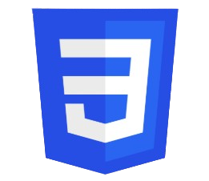

# Curr-culo

<!DOCTYPE html>
<html lang="en">
  <head>
    <meta charset="UTF-8" />
    <meta name="viewport" content="width=device-width, initial-scale=1.0" />
    <title>Document</title>
    <link rel="stylesheet" href="formulario.css" />
    <link href="https://fonts.googleapis.com/css2?family=Montserrat:wght@400;600&display=swap" rel="stylesheet"/>
    <link rel="stylesheet" href="https://cdnjs.cloudflare.com/ajax/libs/font-awesome/6.5.0/css/all.min.css"/>
    <link rel="stylesheet" href="https://cdnjs.cloudflare.com/ajax/libs/font-awesome/6.5.0/css/all.min.css"/>
    <link rel="preconnect" href="https://fonts.googleapis.com">
    <link rel="preconnect" href="https://fonts.gstatic.com" crossorigin>
    <link href="https://fonts.googleapis.com/css2?family=Archivo+Black&display=swap" rel="stylesheet">
  </head>
  <body>
    <header>
      

        

          
        

      

      

        <nav>
          <h1>Allan Poul</h1>
          <h3>Desenvolvedor back-end em formação</h3>
        </nav>
      

    </header>

    <!------------------------------------------------------------------------------------------------------------------->
    <!-----------------------------------------TextoPrincipal------------------------------------------------------------>
    <!------------------------------------------------------------------------------------------------------------------->

    <!-------------------------------------------Parte esquerda---------------------------------------------------->
    

      <aside class="textoPrincipalEsquerda">
        

          

            
<h1>contato</h1>

          

          

            <h3 class="emojiNumero">☎</h3>
            <h3 class="numero123">(81)982891349</h3>
          

          

            <h3 class="iconeEmail">✉</h3>
            <h3 class="emailEscrito">apsg2@discente.ifpe.edu.br</h3>
          

          

            <a href="https://github.com/allangomes12" target="_blank" class="githubEmoji">
              <i class="fa-brands fa-github"></i>
            </a>
            <a
              href="https://github.com/allangomes12"
              target="_blank"
              class="gitHubUsuario">github.com/allangomes12</a>
          

          

            <a href="https://www.linkedin.com/in/allan-p-04530a3b3/"target="_blank" class="linkedinEmoji">
              <i class="fa-brands fa-linkedin"></i>
            </a>
            <a href="https://www.linkedin.com/in/allan-p-04530a3b3/"target="_blank"class="linkedinUsuario">
                Allan Poul
            </a>
          

        

      </aside>

      <!-------------------------------------------Parte direita------------------------------------------------------>
      

        

          <h1>Sobre mim</h1>
        

        

            

              Sou estudante e apreciador da área de tecnologia, com foco em
              desenvolvimento web. Tenho facilidade para aprender novas ferramentas,
              trabalhar em equipe e resolver problemas de forma lógica e
              estruturada. Busco oportunidades que me permitam crescer
              profissionalmente e aplicar meus conhecimentos em projetos reais.
            

        

        

        

        

            

                <h1>Projetos</h1>
            

            

                <button onclick="window.open('asd.html')">ATLÂNTIDA VIVA</button>
            

        

        

        

            

                <h1>Linguagens</h1>
            

            

                    

                        

                            

                                
                            

                            

                                <h1>HTML</h1>
                                
Base em:

                                    <ul>
                                        <li>Estrutura</li>
                                        <li>Sintaxe</li>
                                        <li>Lógica</li>
                                    </ul>
                                
                                <button onclick="window.open('https://www.devmedia.com.br/o-que-e-o-html5/25820', '_blank')">Saber mais...</button>
                            

                        

                    

                    <!------------------------css-------------------------->
                    

                        

                            

                                
                            

                            

                                <h1>CSS</h1>   
                                
Base em:

                                    <ul>
                                        <li>Layout com Flexbox</li>
                                        <li>Sintaxe</li>
                                        <li>Responsividade</li>
                                    </ul>
                                
                                <button onclick="window.open('https://www.hiperbytes.com.br/curso-de-css-aula-01-introducao-as-css-folhas-de-estilo/#:~:text=CSS%20%C3%A9%20abrevia%C3%A7%C3%A3o%20para%20o,marca%C3%A7%C3%A3o%20de%20texto%20(HTML).', '_blank')">Saber mais...</button>
                            

                        

                    

                    <!------------------------------------javaScript---------------------->

                     

                        

                            

                                
                            

                            

                                <h1>JAVASCRIPT</h1>   
                                
Base em:

                                    <ul>
                                        <li>Estru. de repetição</li>
                                        <li>Funções</li>
                                        <li>Laços encadeados</li>
                                    </ul>
                                
                                <button onclick="window.open('https://developer.mozilla.org/pt-BR/docs/Web/JavaScript', '_blank')">Saber mais...</button>
                            

                        

                    

                    <!-----------------------------------------python--------------->

                    

                        

                            

                                
                            

                            

                                <h1>PYTHON</h1>   
                                
Base em:

                                    <ul>
                                        <li>Estru. de repetição</li>
                                        <li>Funções</li>
                                        <li>Laços encadeados</li>
                                    </ul>
                                
                                <button onclick="window.open('https://aws.amazon.com/pt/what-is/python/', '_blank')">Saber mais...</button>
                            

                        

                    

            

        

      

    

  </body>
</html>

/*-------------------------------------------------------------------------------------------------------------------*/
/*---------------------------------------------------Página inteira--------------------------------------------------*/
/*-------------------------------------------------------------------------------------------------------------------*/

* {
  margin: 0;
  padding: 0;
  box-sizing: border-box;
  font-family: "Montserrat";
  letter-spacing: 4px;
}
html {
  font-size: 10px;
}
 

/*-------------------------------------------------------------------------------------------------------------------*/
/*---------------------------------------------------Página inteira--------------------------------------------------*/
/*-------------------------------------------------------------------------------------------------------------------*/

/*------------------------------------------------Cabeçalho----------------------------------------------------------*/
header {
  display: flex;
  background-color: #2b2b2b;
  min-height: clamp(100px,210px,300px);
}
.meuNome {
  display: flex;
  flex-direction: column;
  align-items: center;
  width: 100%;
  justify-content: center;
  
}
.meuNome nav {
  border: 0.1rem  #d8cbb3 solid;
  text-align: center;
  display: flex;
  flex-direction: column;
  align-items: center;
}
.meuNome h1 {
  font-size: clamp(50px, 5vw, 75px);
  color: #d8cbb3;
  padding-left: 20px;
  padding-right: 20px;
  padding-top: 5px;
  padding-bottom: 2px;
}
.meuNome h3 {
  font-size: clamp(6px, 0.8vw, 15px);
  color: #d8cbb3;
  transform: translateY(7px);
  background-color: #2b2b2b;
  width: clamp(200px, 20vw, 300px);
}

/*---------------------------------------------------Minha foto----------------------------------------------*/
header .sombraPretaFoto {
  width: clamp(200px,22.06vw,301px);
  height: clamp(180px,20.59vw,281px);
  background: #2b2b2b; /* nova cor da borda */
  transform: translateY(4vw);
  margin-left: clamp(20px, 4.94vw, 70px);
  display: flex;
  align-items: center;
  justify-content: center;
  clip-path: polygon(50% 0%, 100% 25%, 100% 75%, 50% 100%, 0% 75%, 0% 25%);
   
}
header .img {
  width: clamp(120px, 16.18vw, 221px);
  height: clamp(150px, 18.6vw, 254px);
  background: #d8cbb3; /* primeira borda */
  display: flex;
  align-items: center;
  justify-content: center;
  clip-path: polygon(50% 0%, 100% 25%, 100% 75%, 50% 100%, 0% 75%, 0% 25%);
}
header .img img {
  width: clamp(150px, 15.71vw, 201px);
  height: clamp(130px, 16.91vw, 231px);
  background: #2e3440;
  clip-path: polygon(50% 0%, 100% 25%, 100% 75%, 50% 100%, 0% 75%, 0% 25%);
}

/*---------------------------------------Conteudo completo----------------------------------------------------------*/
/*---------------------------------------Conteudo completo----------------------------------------------------------*/
/*---------------------------------------Conteudo completo----------------------------------------------------------*/
.conteudoCompleto {
  display: flex;
  min-height: clamp(600px, 58.82, 1000px);
  
  
}

aside {
  background-color: #8F7559;
  width: clamp(250px, 35%, 50%);
  height: auto;
}
aside .parteContatoCompleta .contato {
  padding-top: clamp(30px, 90px, 100px);
}
aside .parteContatoCompleta .contato h1 {
  background-color: #2b2b2b;
  color: #d8cbb3;
  width: 200px;
  font-size: 3rem;
  clip-path: polygon(0 0, 100% 0, 100% 0%, 85% 100%, 0 100%);
  display: flex;
  justify-content: end;
  padding-right: 24px;
}

/*---------------------------------------------------icone numero----------------------------------*/
.numero {
  display: flex;
}
.numero .emojiNumero {
  background-color: #2b2b2b;
  color: #ebeae8;
  font-size: clamp(25px, 2.21vw, 31px);
  min-width: 100px;
  clip-path: polygon(0 0, 100% 0, 100% 0%, 60% 100%, 0 100%);
  margin-top: 2.21vw;
  display: flex;
  justify-content: end;
  padding-right: 35px;

}
.numero .numero123 {
  background-color: #2b2b2b;
  color: #ebeae8;
  display: flex;
  align-items: center;
  font-size: clamp(1px, 1vw, 40px);
  margin-top: 24px;
  border-radius: 10px;
  margin-left: 20px;
  padding: 2px;
}

/*-----------------------------------icone email--------------------------------------------*/

.email {
  display: flex;
}
.email .iconeEmail {
  background-color: #2b2b2b;
  color: #ebeae8;
  font-size: clamp(25px, 2.21vw, 31px);
  min-width: 100px;
  clip-path: polygon(0 0, 100% 0, 100% 0%, 60% 100%, 0 100%);
  margin-top: 10px;
  display: flex;
  justify-content: end;
  padding-right: 35px;
}
.email .emailEscrito {
  background-color: #2b2b2b;
  color: #ebeae8;
  border-radius: 10px;
  display: flex;
  align-items: center;
  font-size: clamp(0.5px, 1vw, 40px);
  margin-top: 15px;
  padding: 2px;
}

/*-----------------------------------icone gitHub------------------------------*/

.gitHub {
  display: flex;
}
.gitHub .githubEmoji {
  background-color: #2b2b2b;
  color: #ebeae8;
  font-size: clamp(25px, 2.21vw, 31px);
  min-width: 100px;
  padding: 5px;
  text-decoration: none;
  clip-path: polygon(0 0, 100% 0, 100% 0%, 60% 100%, 0 100%);
  margin-top: 10px;
  display: flex;
  justify-content: end;
  padding-right: 35px;
  align-items: center;
}
.gitHub .gitHubUsuario {
  background-color: #2b2b2b;
  color: #ebeae8;
  display: flex;
  align-items: center;
  font-size: clamp(0.5px, 1vw, 40px);;
  margin-top: 10px;
  text-decoration: none;
  border-radius: 10px;
  padding: 3px;
}
/*---------------------------------------linkedin--------------------------------------------------*/
.linkedin {
  display: flex;
}
.linkedin .linkedinEmoji {
  background-color: #2b2b2b;
  color: #ebeae8;
  font-size: clamp(25px, 2.21vw, 31px);
  min-width: 100px;
  height: 40px;
  align-items: center;
  text-decoration: none;
  clip-path: polygon(0 0, 100% 0, 100% 0%, 60% 100%, 0 100%);
  margin-top: 10px;
  display: flex;
  justify-content: end;
  padding-right: 35px;
}
.linkedin .linkedinUsuario {
  background-color: #2b2b2b;
  color: #ebeae8;
  display: flex;
  align-items: center;
  font-size: clamp(0.5px, 1vw, 40px);;
  margin-top: 15px;
  text-decoration: none;
  padding: 3px;
  border-radius: 10px;
}

/*------------------------------------------------- parte direita ------------------------------------------*/
/*------------------------------------------------- parte direita ------------------------------------------*/
/*------------------------------------------------- parte direita ------------------------------------------*/

.textoPrincipalDireita {
  background-color: #EDE3D2;
  flex: 1;
  min-width: 300px;
  
}

/*----------------------------------------------------Sobre mim------------------------------------------*/
/*----------------------------------------------------Sobre mim------------------------------------------*/
/*----------------------------------------------------Sobre mim------------------------------------------*/
.sobreMim {
  background-color: #2b2b2b;
  margin-top: 40px;
  width: 320px;
  height: 45px;
  align-items: center;
  display: flex;
  justify-content: end;
  clip-path: polygon(0 0, 100% 0, 100% 0%, 85% 100%, 0 100%);
  padding-right: 40px;
  font-size: 1.5rem;
  color: #ebeae8;
}
.textoPrincipalDireita .paragrafoSobreMim {
  text-align: justify;
  margin-left: 5vw;
  margin-right: 5vw;
  padding: 20px;
  border-radius: 24px;
  margin-top: 20px;
  text-indent: 50px;
  color: #2e3440;
  background-color: #CBB89D;
  font-family: "Montserrat";
  font-weight:100;
  font-size: clamp(16px, 1.2vw, 20px);
  display: flex;
  flex-wrap: wrap;
}
.textoPrincipalDireita .paragrafoSobreMim {
  flex: 1 1 350px;
}
/*--------------------------------------------------Projetos-------------------------------------*/
/*--------------------------------------------------Projetos-------------------------------------*/
/*--------------------------------------------------Projetos-------------------------------------*/
.projetosNome {
  background-color: #2b2b2b;
  margin-top: 40px;
  width: 320px;
  height: 45px;
  align-items: center;
  display: flex;
  justify-content: end;
  clip-path: polygon(0 0, 100% 0, 100% 0%, 85% 100%, 0 100%);
  padding-right: 40px;
  font-size: 1.5rem;
  color: #ebeae8;
  
}
.projetosNome {
  display: flex;
  margin-top: 20px;
}
 
.atlantidaProjetos button {
  font-size: 2rem;
  margin-top: 20px;
  margin-left: 65px;
  background-image: url("https://segredosdomundo.r7.com/wp-content/uploads/2021/09/fundo-do-mar-estrutura-misterios-e-curiosidades-sobre-o-oceano-12.jpg") ;
  background-repeat: no-repeat;
  background-position: center;   /* CENTRALIZA */
  background-size: cover;      /* Ajusta sem cortar */
  display: block;
  height: 150px;
  max-width: 300px;
  color: black;
  font-family: "Archivo Black", sans-serif;
  border-radius: 24px;
  border: 1px black solid;
  box-shadow: 2px 1px 10px black;
}
.atlantidaProjetos button:hover{
  border: 3px black solid;
  transform: scale(1.1);
}

/*-----------------------------------------------Linguagens---------------------------------------*/
/*-----------------------------------------------Linguagens---------------------------------------*/
/*-----------------------------------------------Linguagens---------------------------------------*/

.linguagensTitulo{
  background-color: #2b2b2b;
  margin-top: 40px;
  width: 320px;
  height: 45px;
  align-items: center;
  display: flex;
  justify-content: end;
  clip-path: polygon(0 0, 100% 0, 100% 0%, 85% 100%, 0 100%);
  padding-right: 40px;
  font-size: 1.5rem;
  color: #ebeae8;
  margin-top: 20px;
}

/*-------------------------------------------HTML------------------------------------------------*/
/*-------------------------------------------HTML------------------------------------------------*/
/*-------------------------------------------HTML------------------------------------------------*/
.html{
  width: 220px;
  height: 140px;
  perspective: 1000px; /* cria efeito 3D */
  
}
.html-inner{
  width: 100%;
  height: 100%;
  position: relative;
  transition: transform 0.8s;
  transform-style: preserve-3d;
  box-shadow: 5px 5px 10px #2e3440;
  border-radius: 10px;
}
.html:hover .html-inner{
  transform: rotateY(180deg);
}
.html-front, .html-back {
  width: 100%;
  height: 100%;
  position: absolute;
  backface-visibility: hidden;
  border-radius: 10px;
}
.html-front {
  background: #222;
}

.html-front img {
  width: 100%;
  height: 100%;
}

.html-back {
  background: #222;
  color: white;
  transform: rotateY(180deg);
  padding-top: 10px;
  padding-left: 20px;
  
}
.html-back h1{
  font-family: "Archivo Black", sans-serif;
  font-weight: 400;
  font-size: 2rem;
}
.html-back p{
  font-size: 1rem;
}
.html-back ul{ 
  font-family: "Archivo Black", sans-serif;
  font-weight: 400;
  text-indent: 20px;
  list-style: none;

}
.html-back button{
  margin-top: 10px;
  padding: 2px;
  background-color: #2e3440;
  color: #ebeae8;
}
.html-back button:hover{
  box-shadow: 1px 1px 5px white;
}

/*---------------------------------------------------CSS----------------------------------------------*/
/*---------------------------------------------------CSS----------------------------------------------*/
/*---------------------------------------------------CSS----------------------------------------------*/

.css{
  width: 220px;
  height: 140px;
  perspective: 1000px; /* cria efeito 3D */
  
}
.css-inner{
  width: 100%;
  height: 100%;
  position: relative;
  transition: transform 0.8s;
  transform-style: preserve-3d;
  box-shadow: 5px 5px 10px #2e3440;
  border-radius: 10px;
}
.css:hover .css-inner{
  transform: rotateY(180deg);
}
.css-front, .css-back {
  width: 100%;
  height: 100%;
  position: absolute;
  backface-visibility: hidden;
  border-radius: 10px;
}
.css-front {
  background: #222;
}

.css-front img {
  width: 100%;
  height: 100%;
  display: flex;
  justify-content: center;
  align-items: center;
}

.css-back {
  background: #222;
  color: white;
  transform: rotateY(180deg);
  padding-top: 10px;
  padding-left: 20px;
  
}
.css-back h1{
  font-family: "Archivo Black", sans-serif;
  font-weight: 400;
  font-size: 2rem;
}
.css-back p{
  font-size: 1rem;
}
.css-back ul{ 
  font-family: "Archivo Black", sans-serif;
  font-weight: 400;
  text-indent: 20px;
  list-style: none;

}
.css-back button{
  margin-top: 10px;
  padding: 2px;
  background-color: #2e3440;
  color: #ebeae8;
}
.css-back button:hover{
  box-shadow: 1px 1px 5px white;
}

/*---------------------------------------------------JavaScript-------------------------------------*/
/*---------------------------------------------------JavaScript-------------------------------------*/
/*---------------------------------------------------JavaScript-------------------------------------*/

.js{
  width: 220px;
  height: 140px;
  perspective: 1000px; /* cria efeito 3D */
  
}
.js-inner{
  width: 100%;
  height: 100%;
  position: relative;
  transition: transform 0.8s;
  transform-style: preserve-3d;
  box-shadow: 5px 5px 10px #2e3440;
  border-radius: 10px;
}
.js:hover .js-inner{
  transform: rotateY(180deg);
}
.js-front, .js-back {
  width: 100%;
  height: 100%;
  position: absolute;
  backface-visibility: hidden;
  border-radius: 10px;
}
.js-front {
  background: #222;
}

.js-front img {
  width: 100%;
  height: 100%;
  display: flex;
  justify-content: center;
  align-items: center;
}

.js-back {
  background: #222;
  color: white;
  transform: rotateY(180deg);
  padding-top: 10px;
  padding-left: 20px;
  
}
.js-back h1{
  font-family: "Archivo Black", sans-serif;
  font-weight: 400;
  font-size: 2rem;
}
.js-back p{
  font-size: 1rem;
}
.js-back ul{ 
  font-family: "Archivo Black", sans-serif;
  font-weight: 400;
  text-indent: 20px;
  list-style: none;

}
.js-back button{
  margin-top: 10px;
  padding: 2px;
  background-color: #2e3440;
  color: #ebeae8;
}
.js-back button:hover{
  box-shadow: 1px 1px 5px white;
}
/*--------------------------------------------python-----------------------------*/
/*--------------------------------------------python-----------------------------*/
/*--------------------------------------------python-----------------------------*/

.py{
  width: 220px;
  height: 140px;
  perspective: 1000px; /* cria efeito 3D */
  
}
.py-inner{
  width: 100%;
  height: 100%;
  position: relative;
  transition: transform 0.8s;
  transform-style: preserve-3d;
  box-shadow: 5px 5px 10px #2e3440;
  border-radius: 10px;
}
.py:hover .py-inner{
  transform: rotateY(180deg);
}
.py-front, .py-back {
  width: 100%;
  height: 100%;
  position: absolute;
  backface-visibility: hidden;
  border-radius: 10px;
}
.py-front {
  background: #222;
}

.py-front img {
  width: 100%;
  height: 100%;
  display: flex;
  justify-content: center;
  align-items: center;
}

.py-back {
  background: #222;
  color: white;
  transform: rotateY(180deg);
  padding-top: 10px;
  padding-left: 20px;
  
}
.py-back h1{
  font-family: "Archivo Black", sans-serif;
  font-weight: 400;
  font-size: 2rem;
}
.py-back p{
  font-size: 1rem;
}
.py-back ul{ 
  font-family: "Archivo Black", sans-serif;
  font-weight: 400;
  text-indent: 20px;
  list-style: none;

}
.py-back button{
  margin-top: 10px;
  padding: 2px;
  background-color: #2e3440;
  color: #ebeae8;
}
.py-back button:hover{
  box-shadow: 1px 1px 5px white;
}

/*-----------------------------------------Todas as linguagens-----------------------------*/
/*-----------------------------------------Todas as linguagens-----------------------------*/
/*-----------------------------------------Todas as linguagens-----------------------------*/

.todasLinguagens{
  display: flex;
  gap: 15px;
  margin-top: 20px;
  background-color:#CBB89D;
  min-height: 180px;
  align-items: center;
  justify-content: center;
  width: 100%;
  border-radius: 24px;
  flex-wrap: wrap;
}

